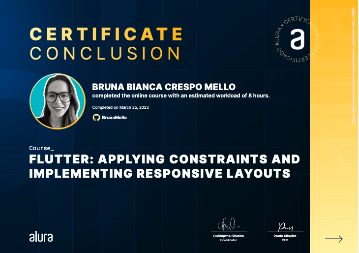

<h1>Flutter: applying constraints and implementing responsive layouts</h1>

Take this Flutter courses and:

- Delimitate the size of widgets with constraints and understand the importance of this
- Build suitable layouts with correct sizes with Constraints
- Implement four screens in a practical food delivery project
- Implement different types of product list
- Make a responsive app that works in vertical and horizontal directions
- Capture device size and orientation with Media.Query
- Understand and use CustomScrollView, Slivers, and classes as Media.Query widgets

## 🔨 Project: Panucci Ristorante

Flutter: applying constraints and implementing responsive layouts

Certificate: 'https://cursos.alura.com.br/certificate/0bbbf20e-ec36-45ee-9329-cebd738c9d9d'

